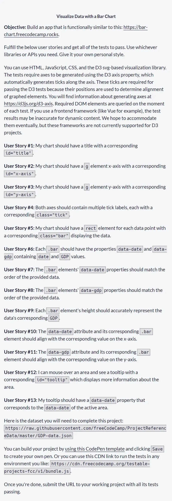
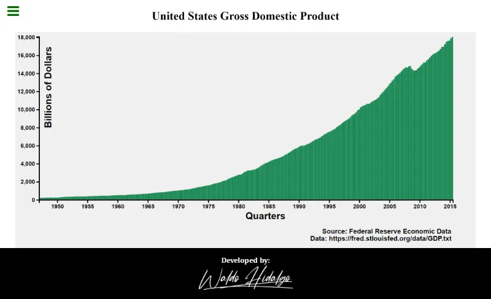
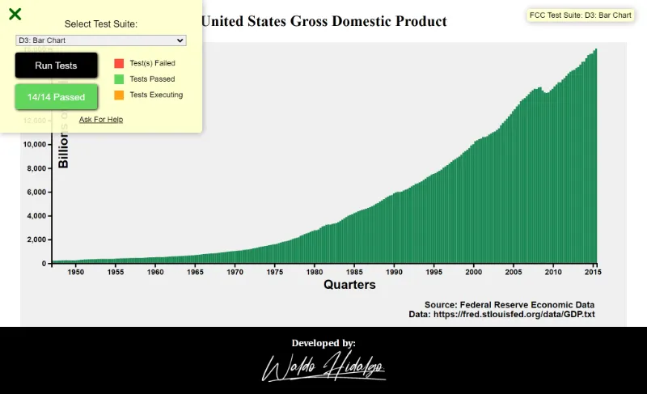
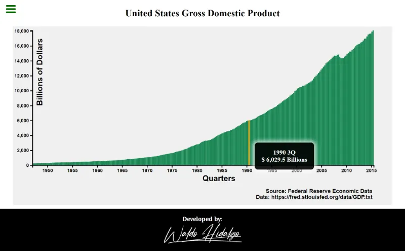

# Bar Chart

Primer proyecto requisito obligatorio para obtener la [**Data Visualization Certification**](https://www.freecodecamp.org/learn/data-visualization/#data-visualization-projects) de Freecodecamp.

## Tabla de Contenido

- [Bar Chart](#bar-chart)
  - [Tabla de Contenido](#tabla-de-contenido)
  - [Requisitos](#requisitos)
  - [Screenshots](#screenshots)
    - [1. Home](#1-home)
    - [2. All tests passed](#2-all-tests-passed)
    - [3.Tooltip](#3tooltip)
      - [3.1. Tooltip mostrado al lado derecho de la columna](#31-tooltip-mostrado-al-lado-derecho-de-la-columna)
      - [3.2. Tooltip mostrado al lado izquierdo de la columna](#32-tooltip-mostrado-al-lado-izquierdo-de-la-columna)

## Requisitos

## Screenshots

### 1. Home

### 2. All tests passed

### 3.Tooltip

Los tooltips se muestran **dentro** del gráfico:

#### 3.1. Tooltip mostrado al lado derecho de la columna

#### 3.2. Tooltip mostrado al lado izquierdo de la columna

